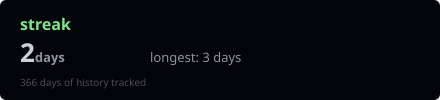
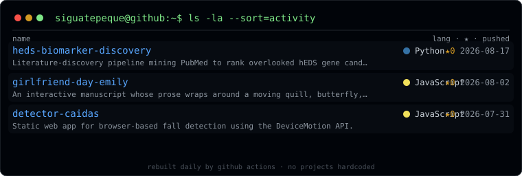

<!-- ═══════════════ typing header (animated typewriter loop) ═══════════════ -->

  

<!-- ═══════════════ the rice: animated terminal session (self-hosted) ═══════════════ -->

  

<!-- ═══════════════ vitals, self-hosted, rebuilt daily ═══════════════ -->

  
  

<!-- ═══════════════ live repo index: clickable, zero hardcoding ═══════════════ -->

  

<!-- ═══════════════ the snake easter egg ═══════════════ -->

🐍 psst — a snake eats my contributions in here

  <picture>
    <source media="(prefers-color-scheme: dark)" srcset="https://raw.githubusercontent.com/Siguatepeque/Siguatepeque/output/github-contribution-grid-snake-dark.svg" />
    <source media="(prefers-color-scheme: light)" srcset="https://raw.githubusercontent.com/Siguatepeque/Siguatepeque/output/github-contribution-grid-snake.svg" />
    
  </picture>

<!-- ═══════════════ footprint ═══════════════ -->

  

honduran · 20 · hEDS · some computer stuff, some medical stuff · <b>larping on github</b>

