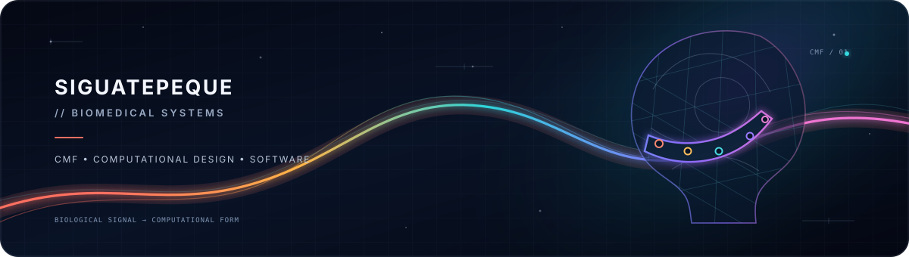
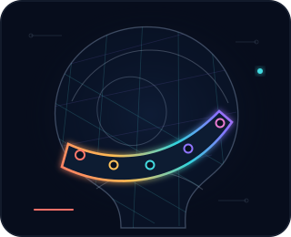

  

  
  
  
  

<table>
  <tr>
    <td width="70%" valign="middle">
      <h2>Hey, I’m Siguatepeque.</h2>
      
I’m working toward biomedical engineering and patient-specific cranio-maxillofacial implant design. I build software where biology, data, and design meet—turning open evidence, sensor signals, and computational ideas into useful systems.

      
Exploring the path from biological signal → computational model → patient-specific form.

    </td>
    <td width="30%" align="center" valign="middle">
      
    </td>
  </tr>
</table>

  

## Current coordinates

<table>
  <tr>
    <td width="33%" valign="top">
      <strong>01 / CMF implant design</strong> 
      Learning the anatomy, geometry, and computational workflows behind patient-specific cranio-maxillofacial devices.
    </td>
    <td width="33%" valign="top">
      <strong>02 / Biomedical discovery</strong> 
      Using literature and public biomedical sources to surface signals that deserve a closer look.
    </td>
    <td width="34%" valign="top">
      <strong>03 / Sensing &amp; automation</strong> 
      Prototyping browser-based sensing and small software systems around real human needs.
    </td>
  </tr>
</table>

## Selected builds

<table>
  <tr>
    <td width="36%" valign="top">
      <a href="https://github.com/Siguatepeque/heds-biomarker-discovery"><strong>heds-biomarker-discovery</strong></a> 
      PYTHON · BIOMEDICAL DATA
    </td>
    <td width="64%" valign="top">A literature-discovery pipeline that mines PubMed and ranks overlooked hEDS gene candidates against public biomedical sources.</td>
  </tr>
  <tr>
    <td width="36%" valign="top">
      <a href="https://github.com/Siguatepeque/detector-caidas"><strong>detector-caidas</strong></a> 
      JAVASCRIPT · DEVICEMOTION
    </td>
    <td width="64%" valign="top">A static browser fall-detection app that turns device motion signals into an accessible, install-free prototype.</td>
  </tr>
  <tr>
    <td width="36%" valign="top">
      <a href="https://github.com/Siguatepeque/girlfriend-day-emily"><strong>girlfriend-day-emily</strong></a> 
      JAVASCRIPT · INTERACTIVE WEB
    </td>
    <td width="64%" valign="top">An interactive JavaScript manuscript built as a personal, narrative web experience.</td>
  </tr>
</table>

## GitHub signal

  
  

  BUILDING AT THE INTERSECTION OF ANATOMY, EVIDENCE &amp; COMPUTATIONAL FORM 
  CMF · BIOMEDICAL COMPUTATION · OPEN EXPLORATION

