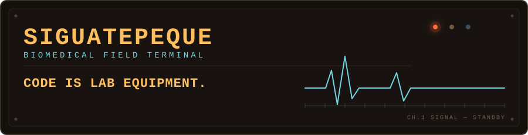

<div align="center">

<picture>
  <source media="(prefers-color-scheme: dark)" srcset="profile/hero-dark.svg">
  <source media="(prefers-color-scheme: light)" srcset="profile/hero-light.svg">
  
</picture>

</div>

Future biomedical master, currently larping on GitHub. Code gets treated like lab equipment here — built to mine a signal, not to pass a linter.

<picture>
  <source media="(prefers-color-scheme: dark)" srcset="profile/divider-dark.svg">
  <source media="(prefers-color-scheme: light)" srcset="profile/divider-light.svg">
  
</picture>

```
OPERATING PARAMETERS
──────────────────────────────────────────────────────────
  SIGNAL DOMAINS     literature mining · biosignal processing
                     · finite-state modeling

  INSTRUMENTATION    python · javascript · public biomedical
                     data

  STANDING QUESTION  which overlooked genes, motions, or
                     folk claims are actually testable?

  MODE               curious · slow · unglamorous
──────────────────────────────────────────────────────────
```

<picture>
  <source media="(prefers-color-scheme: dark)" srcset="profile/divider-dark.svg">
  <source media="(prefers-color-scheme: light)" srcset="profile/divider-light.svg">
  
</picture>

<!-- ACTIVE_LOG:START -->
<pre>
&gt; ACTIVE_LOG ───────────────────────────────────────────
  <a href="https://github.com/Siguatepeque/heds-biomarker-discovery"><b>heds-biomarker-discovery</b></a>  [python]
      Literature-discovery pipeline mining PubMed t…
      last signal 17 Aug
────────────────────────────────────────────────────────
  STATUS  1 experiment running
</pre>
<!-- ACTIVE_LOG:END -->

<details>
<summary>FIELD NOTES — expand archive</summary>

- public datasets treated as primary sources, not decoration
- human signals: motion, rhythm, anything a sensor can log
- literature mining as a way to find what everyone else skipped
- folklore and offhand claims, tested rather than dismissed

</details>

<sub>— signal logged. the terminal stays on.</sub>
