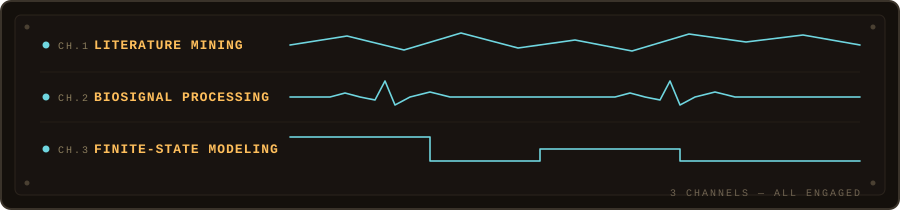

<picture>
  <source media="(prefers-color-scheme: dark)" srcset="profile/hero-dark.svg">
  <source media="(prefers-color-scheme: light)" srcset="profile/hero-light.svg">
  
</picture>

Future Biomedical Engineer Master, larping in GitHub.

<picture>
  <source media="(prefers-color-scheme: dark)" srcset="profile/divider-dark.svg">
  <source media="(prefers-color-scheme: light)" srcset="profile/divider-light.svg">
  
</picture>

<picture>
  <source media="(prefers-color-scheme: dark)" srcset="profile/signal-bank-dark.svg">
  <source media="(prefers-color-scheme: light)" srcset="profile/signal-bank-light.svg">
  
</picture>

<picture>
  <source media="(prefers-color-scheme: dark)" srcset="profile/divider-dark.svg">
  <source media="(prefers-color-scheme: light)" srcset="profile/divider-light.svg">
  
</picture>

<!-- ACTIVE_LOG:START -->
<pre>
&gt; ACTIVE_LOG ───────────────────────────────────────────
  <a href="https://github.com/Siguatepeque/heds-biomarker-discovery"><b>heds-biomarker-discovery</b></a>  [python]
      Literature-discovery pipeline mining PubMed t…
      last signal 17 Aug
────────────────────────────────────────────────────────
  STATUS  1 experiment running
</pre>
<!-- ACTIVE_LOG:END -->

— signal logged. the terminal stays on.
